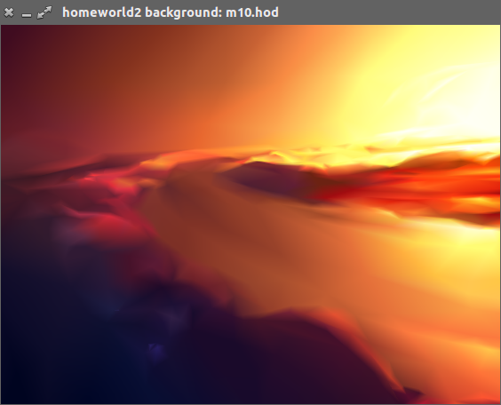

## Description

This tool can be used to view the space backgrounds from the game Homeworld 2.

What makes backgrounds these special from a technical viewpoint is that they are not
background or cubemap textures but tesselated spheres with vertex colors. The geometry
is more finely tesselated in places where more precision is needed in the image.

For further information on the way that the Homeworld 2 backgrounds work 
please refer to these Simon Schreibt articles:

- [Homeworld 2 – Backgrounds](http://simonschreibt.de/gat/homeworld-2-backgrounds/)
- [Homeworld 2 – Backgrounds Tech](http://simonschreibt.de/gat/homeworld-2-backgrounds-tech/)

## Dependencies

The following Python 3.x dependencies are needed to run the program:

```
pip3 install --home pyopengl numpy glfw
```

## Usage

Launch the program from the command line with the name of the background to display,

```bash
./visualize.py background/m01.hod 
```

Drag with the left mouse button pressed to rotate the view.
- `w` to toggle wireframe mode.
- `s` to toggle slow mode.
- `esc` to quit.

## Extracting the data files

The data files in `background/*` are part of the original game and cannot be distributed with
this program.

Extracting the .hod files can be done in the following way:

- Install homeworld 2 from the CD

- Apply patch to 1.1 (not sure this is needed)

- Extract background/ from homeworld2.big
  The big file format is described in `doc/big_file_format.html` in this repository.
  I used the `UnfBIG` tool for this (can be found [here](http://www.homeworldaccess.net/downloads.php?cat_id=8&download_id=53) )
  You just need to extract the files, no deobfuscation of the lua files is needed.

- Find `.hod` files that have associated `_light.hod`. The `_light.hod` variants contain the position of the lights and
are not needed at this point.

These are the following:

    background/black.hod
    background/m01.hod
    background/m02.hod
    background/m03.hod
    background/m04.hod
    background/m05.hod
    background/m06.hod
    background/m07.hod
    background/m08.hod
    background/m09.hod
    background/m10.hod
    background/m11.hod
    background/m12.hod
    background/m13.hod
    background/m14.hod
    background/m15.hod
    background/white.hod

The hod files in other directories space ship models and such. These can not currently be viewed with this
tool as the vertex format is different.

